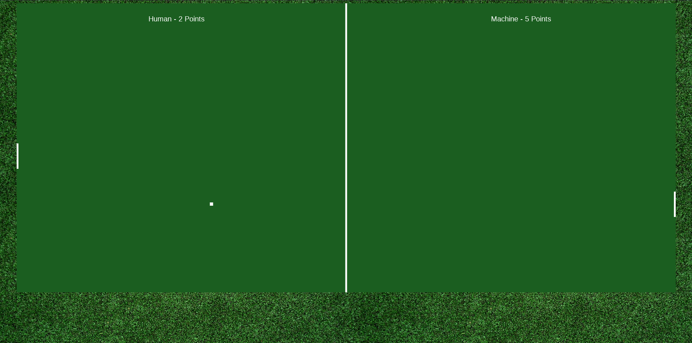

# Pong-JS

  

Hi, my name is Lucas and this is a project where I recreated the famous Pong game.

## Technologies

I used HTML (Canvas), JavaScript and very little CSS, but basically these technologies were used.

## How to use

You just need to download the file and open the index.html file and then have fun :).
